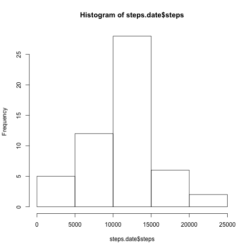
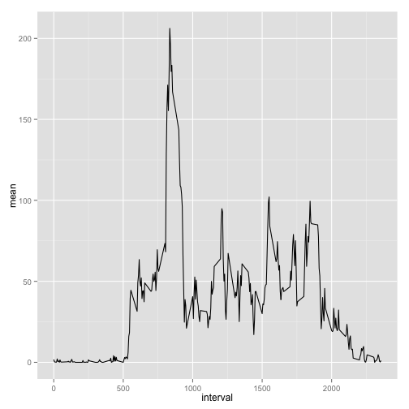
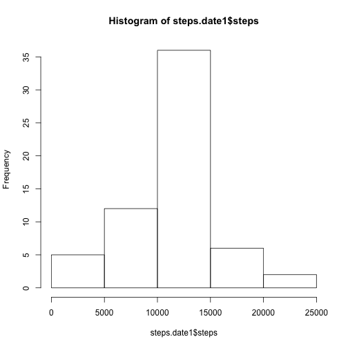
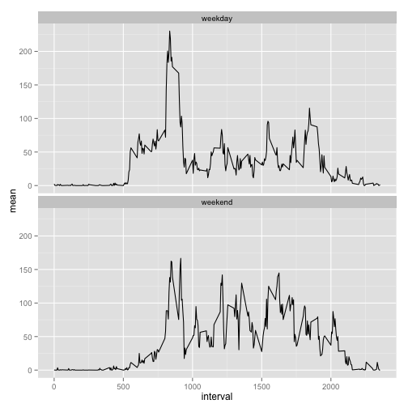

# Reproducible Research: Peer Assessment 1


## Loading and preprocessing the data

```r
dataset = read.csv("activity.csv")
dataset$date = strptime(dataset$date, "%Y-%m-%d")
head(dataset)
```

```
##   steps       date interval
## 1    NA 2012-10-01        0
## 2    NA 2012-10-01        5
## 3    NA 2012-10-01       10
## 4    NA 2012-10-01       15
## 5    NA 2012-10-01       20
## 6    NA 2012-10-01       25
```


## What is mean total number of steps taken per day?
clean.dataset: ignore missing values

```r
clean.dataset = na.omit(dataset)
head(clean.dataset)
```

```
##     steps       date interval
## 289     0 2012-10-02        0
## 290     0 2012-10-02        5
## 291     0 2012-10-02       10
## 292     0 2012-10-02       15
## 293     0 2012-10-02       20
## 294     0 2012-10-02       25
```


Histogram of the total number of steps taken each day

```r
library(plyr)
steps.date = ddply(clean.dataset, ~date, summarize, sum = sum(steps))
colnames(steps.date) = c("date", "steps")
hist(steps.date$steps)
```

 


The **mean** and **median** total number of steps taken per day

```r
steps.date.mean = ddply(clean.dataset, ~date, summarize, mean = mean(steps), 
    median = median(steps))
steps.date.mean
```

```
##          date    mean median
## 1  2012-10-02  0.4375      0
## 2  2012-10-03 39.4167      0
## 3  2012-10-04 42.0694      0
## 4  2012-10-05 46.1597      0
## 5  2012-10-06 53.5417      0
## 6  2012-10-07 38.2465      0
## 7  2012-10-09 44.4826      0
## 8  2012-10-10 34.3750      0
## 9  2012-10-11 35.7778      0
## 10 2012-10-12 60.3542      0
## 11 2012-10-13 43.1458      0
## 12 2012-10-14 52.4236      0
## 13 2012-10-15 35.2049      0
## 14 2012-10-16 52.3750      0
## 15 2012-10-17 46.7083      0
## 16 2012-10-18 34.9167      0
## 17 2012-10-19 41.0729      0
## 18 2012-10-20 36.0938      0
## 19 2012-10-21 30.6285      0
## 20 2012-10-22 46.7361      0
## 21 2012-10-23 30.9653      0
## 22 2012-10-24 29.0104      0
## 23 2012-10-25  8.6528      0
## 24 2012-10-26 23.5347      0
## 25 2012-10-27 35.1354      0
## 26 2012-10-28 39.7847      0
## 27 2012-10-29 17.4236      0
## 28 2012-10-30 34.0938      0
## 29 2012-10-31 53.5208      0
## 30 2012-11-02 36.8056      0
## 31 2012-11-03 36.7049      0
## 32 2012-11-05 36.2465      0
## 33 2012-11-06 28.9375      0
## 34 2012-11-07 44.7326      0
## 35 2012-11-08 11.1771      0
## 36 2012-11-11 43.7778      0
## 37 2012-11-12 37.3785      0
## 38 2012-11-13 25.4722      0
## 39 2012-11-15  0.1424      0
## 40 2012-11-16 18.8924      0
## 41 2012-11-17 49.7882      0
## 42 2012-11-18 52.4653      0
## 43 2012-11-19 30.6979      0
## 44 2012-11-20 15.5278      0
## 45 2012-11-21 44.3993      0
## 46 2012-11-22 70.9271      0
## 47 2012-11-23 73.5903      0
## 48 2012-11-24 50.2708      0
## 49 2012-11-25 41.0903      0
## 50 2012-11-26 38.7569      0
## 51 2012-11-27 47.3819      0
## 52 2012-11-28 35.3576      0
## 53 2012-11-29 24.4688      0
```


## What is the average daily activity pattern?
A time series plot of the 5-minute interval (x-axis) and 
the average number of steps taken, averaged across all days (y-axis)

```r
steps.interval.mean = ddply(clean.dataset, ~interval, summarize, mean = mean(steps))
library(ggplot2)
g = ggplot(steps.interval.mean, aes(interval, mean))
g + geom_line()
```

 


The 5-minute interval, on average across all the days 
in the dataset, that contains the maximum number of steps:

```r
steps.interval.mean[steps.interval.mean$mean == max(steps.interval.mean$mean), 
    "interval"]
```

```
## [1] 835
```


## Imputing missing values
The total number of rows with missing values in the dataset:

```r
nrow(dataset[is.na(dataset), ])
```

```
## [1] 2304
```


Going to impute each NA steps with mean of that 5-min interval across the rest of  dataset.

impute.dataset: new dataset that is equal to the original dataset 
but with the missing data filled in.

```r
impute.dataset = merge(dataset, steps.interval.mean, by = "interval")
for (i in 1:nrow(impute.dataset)) {
    if (is.na(impute.dataset[i, "steps"])) {
        impute.dataset[i, "steps"] = impute.dataset[i, "mean"]
    }
}
impute.dataset$mean = NULL
head(impute.dataset)
```

```
##   interval steps       date
## 1        0 1.717 2012-10-01
## 2        0 0.000 2012-11-23
## 3        0 0.000 2012-10-28
## 4        0 0.000 2012-11-06
## 5        0 0.000 2012-11-24
## 6        0 0.000 2012-11-15
```


Compare with dataset where missing values were ignored.
impute.dataset, Histogram of the total number of steps taken each day

```r
steps.date1 = ddply(impute.dataset, ~date, summarize, sum = sum(steps))
colnames(steps.date1) = c("date", "steps")
hist(steps.date1$steps)
```

 


impute.dataset, The **mean** and **median** total number of steps taken per day

```r
steps.date.mean1 = ddply(impute.dataset, ~date, summarize, mean = mean(steps), 
    median = median(steps))
steps.date.mean1
```

```
##          date    mean median
## 1  2012-10-01 37.3826  34.11
## 2  2012-10-02  0.4375   0.00
## 3  2012-10-03 39.4167   0.00
## 4  2012-10-04 42.0694   0.00
## 5  2012-10-05 46.1597   0.00
## 6  2012-10-06 53.5417   0.00
## 7  2012-10-07 38.2465   0.00
## 8  2012-10-08 37.3826  34.11
## 9  2012-10-09 44.4826   0.00
## 10 2012-10-10 34.3750   0.00
## 11 2012-10-11 35.7778   0.00
## 12 2012-10-12 60.3542   0.00
## 13 2012-10-13 43.1458   0.00
## 14 2012-10-14 52.4236   0.00
## 15 2012-10-15 35.2049   0.00
## 16 2012-10-16 52.3750   0.00
## 17 2012-10-17 46.7083   0.00
## 18 2012-10-18 34.9167   0.00
## 19 2012-10-19 41.0729   0.00
## 20 2012-10-20 36.0938   0.00
## 21 2012-10-21 30.6285   0.00
## 22 2012-10-22 46.7361   0.00
## 23 2012-10-23 30.9653   0.00
## 24 2012-10-24 29.0104   0.00
## 25 2012-10-25  8.6528   0.00
## 26 2012-10-26 23.5347   0.00
## 27 2012-10-27 35.1354   0.00
## 28 2012-10-28 39.7847   0.00
## 29 2012-10-29 17.4236   0.00
## 30 2012-10-30 34.0938   0.00
## 31 2012-10-31 53.5208   0.00
## 32 2012-11-01 37.3826  34.11
## 33 2012-11-02 36.8056   0.00
## 34 2012-11-03 36.7049   0.00
## 35 2012-11-04 37.3826  34.11
## 36 2012-11-05 36.2465   0.00
## 37 2012-11-06 28.9375   0.00
## 38 2012-11-07 44.7326   0.00
## 39 2012-11-08 11.1771   0.00
## 40 2012-11-09 37.3826  34.11
## 41 2012-11-10 37.3826  34.11
## 42 2012-11-11 43.7778   0.00
## 43 2012-11-12 37.3785   0.00
## 44 2012-11-13 25.4722   0.00
## 45 2012-11-14 37.3826  34.11
## 46 2012-11-15  0.1424   0.00
## 47 2012-11-16 18.8924   0.00
## 48 2012-11-17 49.7882   0.00
## 49 2012-11-18 52.4653   0.00
## 50 2012-11-19 30.6979   0.00
## 51 2012-11-20 15.5278   0.00
## 52 2012-11-21 44.3993   0.00
## 53 2012-11-22 70.9271   0.00
## 54 2012-11-23 73.5903   0.00
## 55 2012-11-24 50.2708   0.00
## 56 2012-11-25 41.0903   0.00
## 57 2012-11-26 38.7569   0.00
## 58 2012-11-27 47.3819   0.00
## 59 2012-11-28 35.3576   0.00
## 60 2012-11-29 24.4688   0.00
## 61 2012-11-30 37.3826  34.11
```


Comparison of mean and median of both datasets

```r
merge(steps.date.mean, steps.date.mean1, by = "date", all.y = TRUE)
```

```
##          date  mean.x median.x  mean.y median.y
## 1  2012-10-01      NA       NA 37.3826    34.11
## 2  2012-10-02  0.4375        0  0.4375     0.00
## 3  2012-10-03 39.4167        0 39.4167     0.00
## 4  2012-10-04 42.0694        0 42.0694     0.00
## 5  2012-10-05 46.1597        0 46.1597     0.00
## 6  2012-10-06 53.5417        0 53.5417     0.00
## 7  2012-10-07 38.2465        0 38.2465     0.00
## 8  2012-10-08      NA       NA 37.3826    34.11
## 9  2012-10-09 44.4826        0 44.4826     0.00
## 10 2012-10-10 34.3750        0 34.3750     0.00
## 11 2012-10-11 35.7778        0 35.7778     0.00
## 12 2012-10-12 60.3542        0 60.3542     0.00
## 13 2012-10-13 43.1458        0 43.1458     0.00
## 14 2012-10-14 52.4236        0 52.4236     0.00
## 15 2012-10-15 35.2049        0 35.2049     0.00
## 16 2012-10-16 52.3750        0 52.3750     0.00
## 17 2012-10-17 46.7083        0 46.7083     0.00
## 18 2012-10-18 34.9167        0 34.9167     0.00
## 19 2012-10-19 41.0729        0 41.0729     0.00
## 20 2012-10-20 36.0938        0 36.0938     0.00
## 21 2012-10-21 30.6285        0 30.6285     0.00
## 22 2012-10-22 46.7361        0 46.7361     0.00
## 23 2012-10-23 30.9653        0 30.9653     0.00
## 24 2012-10-24 29.0104        0 29.0104     0.00
## 25 2012-10-25  8.6528        0  8.6528     0.00
## 26 2012-10-26 23.5347        0 23.5347     0.00
## 27 2012-10-27 35.1354        0 35.1354     0.00
## 28 2012-10-28 39.7847        0 39.7847     0.00
## 29 2012-10-29 17.4236        0 17.4236     0.00
## 30 2012-10-30 34.0938        0 34.0938     0.00
## 31 2012-10-31 53.5208        0 53.5208     0.00
## 32 2012-11-01      NA       NA 37.3826    34.11
## 33 2012-11-02 36.8056        0 36.8056     0.00
## 34 2012-11-03 36.7049        0 36.7049     0.00
## 35 2012-11-04      NA       NA 37.3826    34.11
## 36 2012-11-05 36.2465        0 36.2465     0.00
## 37 2012-11-06 28.9375        0 28.9375     0.00
## 38 2012-11-07 44.7326        0 44.7326     0.00
## 39 2012-11-08 11.1771        0 11.1771     0.00
## 40 2012-11-09      NA       NA 37.3826    34.11
## 41 2012-11-10      NA       NA 37.3826    34.11
## 42 2012-11-11 43.7778        0 43.7778     0.00
## 43 2012-11-12 37.3785        0 37.3785     0.00
## 44 2012-11-13 25.4722        0 25.4722     0.00
## 45 2012-11-14      NA       NA 37.3826    34.11
## 46 2012-11-15  0.1424        0  0.1424     0.00
## 47 2012-11-16 18.8924        0 18.8924     0.00
## 48 2012-11-17 49.7882        0 49.7882     0.00
## 49 2012-11-18 52.4653        0 52.4653     0.00
## 50 2012-11-19 30.6979        0 30.6979     0.00
## 51 2012-11-20 15.5278        0 15.5278     0.00
## 52 2012-11-21 44.3993        0 44.3993     0.00
## 53 2012-11-22 70.9271        0 70.9271     0.00
## 54 2012-11-23 73.5903        0 73.5903     0.00
## 55 2012-11-24 50.2708        0 50.2708     0.00
## 56 2012-11-25 41.0903        0 41.0903     0.00
## 57 2012-11-26 38.7569        0 38.7569     0.00
## 58 2012-11-27 47.3819        0 47.3819     0.00
## 59 2012-11-28 35.3576        0 35.3576     0.00
## 60 2012-11-29 24.4688        0 24.4688     0.00
## 61 2012-11-30      NA       NA 37.3826    34.11
```

All days have mean and median now.


## Are there differences in activity patterns between weekdays and weekends?

day.type: New factor variable "weekday" and "weekend" indicating whether a given date is a weekday or weekend day.

```r
impute.dataset$weekdays = weekdays(impute.dataset$date)
impute.dataset$day.type = "weekday"
impute.dataset[impute.dataset$weekdays == "Saturday" | impute.dataset$weekdays == 
    "Sunday", "day.type"] = "weekend"
impute.dataset$day.type = as.factor(impute.dataset$day.type)
head(impute.dataset)
```

```
##   interval steps       date weekdays day.type
## 1        0 1.717 2012-10-01   Monday  weekday
## 2        0 0.000 2012-11-23   Friday  weekday
## 3        0 0.000 2012-10-28   Sunday  weekend
## 4        0 0.000 2012-11-06  Tuesday  weekday
## 5        0 0.000 2012-11-24 Saturday  weekend
## 6        0 0.000 2012-11-15 Thursday  weekday
```

```r
impute.dataset = impute.dataset[order(impute.dataset$date, impute.dataset$interval), 
    ]
head(impute.dataset)
```

```
##     interval   steps       date weekdays day.type
## 1          0 1.71698 2012-10-01   Monday  weekday
## 63         5 0.33962 2012-10-01   Monday  weekday
## 128       10 0.13208 2012-10-01   Monday  weekday
## 205       15 0.15094 2012-10-01   Monday  weekday
## 264       20 0.07547 2012-10-01   Monday  weekday
## 327       25 2.09434 2012-10-01   Monday  weekday
```


Plot of weekdays and weekends

```r
steps.interval.mean1 = ddply(impute.dataset, .(interval, day.type), summarize, 
    mean = mean(steps))

g = ggplot(steps.interval.mean1, aes(interval, mean))
g + geom_line() + facet_wrap(~day.type, nrow = 2, ncol = 1)
```

 

Yes, there is difference in activity between weekdays and weekends. the max of weekday is higher but it seems the weekend is more active overall.
